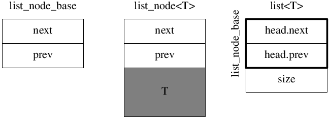

# Doubly Linked List: `list<T>`


## Data Structure

`list_node_base` and `list_node<T>`

```cpp
struct list_node_base
{
  list_node_base* next;
  list_node_base* prev;
};

template <typename T>
struct list_node : list_node_base
{
  T value_;
};
```

`list<T>`

```cpp
template <typename T>
class list
{
 public:
  list()
  {
    head_.next = &head_;
    head_.prev = &head_;
  }

 private:
  list_node_base head_;
  size_t size_ = 0;
};
```



Doubly linked list:


## list00: `node` and `node_base`

### list00a: `typedef`

### list00b: accessors

## list01: `push_front`

### Mistake: use-after-free

list01err0.cc

### Mistake: delete `list_node_base*`

list01err1.cc
// list_node_base* tod = n; is wrong

### list01a: `node_base` with `protected` destructor

GCC [Bug 54812](https://gcc.gnu.org/bugzilla/show_bug.cgi?id=54812)

### More tests on T

## list02: copy control

## list03: iterator
